# 🚀 Post Service Project

## 📝프로젝트 소개

---
> 회원 인증/인가 및 게시글, 댓글 CRUD 기능을 제공하는 게시판 REST API 서버입니다.
>> - 사용자는 자체 회원가입 또는 Google 소셜 로그인을 통해 가입할 수 있으며, 게시글, 댓글, 대댓글을 자유롭게 작성하여 소통할 수 있습니다.
>> - 게시글 목록은 검색과 페이지네이션 기능을 통해 효율적으로 탐색할 수 있습니다.


## 🔄 버전 이력 및 개선 방향

---
해당 프로젝트는 동일한 게시판 서비스를 **두 가지 방식(v1, v2)** 으로 구현하며, 기술 선택과 설계의 차이를 비교하고 학습하는 데 목적이 있었습니다.

- **v1**
  - 2024.07 ~ 2024.08 진행 (약 1개월)
  - `Thymeleaf` 뷰 기반 서버 사이드 렌더링
  - `MyBatis`를 이용한 SQL 매핑
  - `Session` 기반의 인증/인가 방식

- **v2**
  - 2025.02 ~ 2025.04 (약 2개월)
  - **RESTful API 구조**로 재설계
  - `Spring Data JPA + QueryDSL`을 활용한 ORM 기반 개발
  - `Spring Security`, `JWT`, `OAuth 2.0`을 활용한 **토큰 기반 인증/인가** 구현


## 🧱 주요 기술 스택 (v2 기준)

---
### ✅ Backend

- **Java 17**
  - **Spring Boot 3.3.2**
  - **Spring Data JPA**, **QueryDSL**
  - **Spring Validation**
  - **Spring Security**, **JWT**, **OAuth 2.0**
  - **Spring HATEOAS**
  - **SpringDoc OpenAPI (Swagger UI)**
  - **H2 Database** (개발용 인메모리 DB)
  - **Gradle** (빌드 도구)

### ✅ Infra & Documentation

- **Git**, **GitHub** (버전 관리)
  - **Notion** (기획)
  - **Junit 5** (테스트 프레임워크)
  - **Lombok**

## 📂 프로젝트 디렉토리 구조 (v2 기준)

---

```text
src
└── main
    ├── java
    │   └── hong
    │       └── postService
    │           ├── PostServiceApplication.java
    │           ├── config
    │           │   ├── Configs.java
    │           │   ├── CorsConfig.java
    │           │   └── SecurityConfig.java
    │           ├── domain
    │           │   ├── Comment.java
    │           │   ├── Member.java
    │           │   ├── Post.java
    │           │   ├── UserRole.java
    │           │   └── baseEntity
    │           │       └── BaseTimeEntity.java
    │           ├── exception
    │           │   ├── ErrorResponse.java
    │           │   ├── comment
    │           │   │   ├── CommentNotFoundException.java
    │           │   │   └── InvalidCommentFieldException.java
    │           │   ├── member
    │           │   │   ├── DuplicateMemberFieldException.java
    │           │   │   ├── IllegalEmailFormatException.java
    │           │   │   ├── InvalidMemberFieldException.java
    │           │   │   ├── MemberNotFoundException.java
    │           │   │   └── PasswordMismatchException.java
    │           │   └── post
    │           │       ├── InvalidPostFieldException.java
    │           │       └── PostNotFoundException.java
    │           ├── repository
    │           │   ├── commentRepository
    │           │   │   └── v2
    │           │   │       └── CommentRepository.java
    │           │   ├── memberRepository
    │           │   │   └── v2
    │           │   │       └── MemberRepository.java
    │           │   └── postRepository
    │           │       └── v2
    │           │           ├── PostRepository.java
    │           │           ├── PostRepositoryCustom.java
    │           │           ├── PostRepositoryImpl.java
    │           │           └── SearchCond.java
    │           ├── service
    │           │   ├── commentService
    │           │   │   ├── dto
    │           │   │   │   ├── CommentCreateRequest.java
    │           │   │   │   ├── CommentResponse.java
    │           │   │   │   └── CommentUpdateRequest.java
    │           │   │   └── v2
    │           │   │       └── CommentService.java
    │           │   ├── memberService
    │           │   │   ├── dto
    │           │   │   │   ├── MemberUpdateInfoRequest.java
    │           │   │   │   ├── OAuthCreateRequest.java
    │           │   │   │   ├── PasswordUpdateRequest.java
    │           │   │   │   └── UserCreateRequest.java
    │           │   │   └── v2
    │           │   │       └── MemberService.java
    │           │   ├── postService
    │           │   │   ├── dto
    │           │   │   │   ├── PostCreateRequest.java
    │           │   │   │   ├── PostDetailResponse.java
    │           │   │   │   ├── PostSummaryResponse.java
    │           │   │   │   └── PostUpdateRequest.java
    │           │   │   └── v2
    │           │   │       └── PostService.java
    │           │   └── userDetailsService
    │           │       ├── CustomOAuth2UserService.java
    │           │       ├── CustomUserDetailsService.java
    │           │       └── dto
    │           │           ├── CustomOAuth2User.java
    │           │           ├── CustomUserDetails.java
    │           │           ├── GoogleResponse.java
    │           │           └── OAuth2Response.java
    │           └── web
    │               ├── GlobalExceptionHandler.java
    │               ├── HomeController.java
    │               ├── comment
    │               │   └── v2
    │               │       └── CommentController.java
    │               ├── jwt
    │               │   ├── JwtAuthenticationFilter.java
    │               │   ├── JwtFilter.java
    │               │   ├── JwtUtil.java
    │               │   └── LoginRequest.java
    │               ├── members
    │               │   ├── dto
    │               │   │   └── MemberResponse.java
    │               │   └── v2
    │               │       └── MemberController.java
    │               ├── oauth2
    │               │   ├── CustomAuthenticationEntryPoint.java
    │               │   └── CustomSuccessHandler.java
    │               └── posts
    │                   └── v2
    │                       └── PostController.java
```

---
## 📡 API 엔드포인트 요약

---
| 기능                     | Method | Endpoint                               | 인증     | 권한 조건      |
|------------------------|--------|----------------------------------------|--------|------------|
| 일반 회원가입                | POST   | /v2/users                              | 🔓 불필요 | 누구나 호출 가능  |
| 어드민 회원가입               | POST   | /v2/users/admin                        | 🔓 불필요 | 누구나 호출 가능  |
| 일반 로그인                 | POST   | /v2/users/login                        | 🔓 불필요 | 누구나 호출 가능  |
| 소셜 로그인(Google)         | GET    | /oauth2/authorization/google           | 🔓 불필요 | 누구나 호출 가능  |
| 회원 게시글 목록 조회 (Simple)  | GET    | /v2/users/me/posts-simple              | 🔒 필요  | 로그인한 사용자   |
| 회원 게시글 목록 조회 (HATEOAS) | GET    | /v2/users/me/posts-standard            | 🔒 필요  | 로그인한 사용자   |
| 회원 정보 수정               | PATCH  | /v2/users/me                           | 🔒 필요  | 로그인한 사용자   |
| 비밀번호 수정                | PATCH  | /v2/users/me/password                  | 🔒 필요  | 로그인한 사용자   |
| 회원 탈퇴                  | DELETE | /v2/users/me                           | 🔒 필요  | 로그인한 사용자   |
| 게시글 작성                 | POST   | /v2/users/me/posts                     | 🔒 필요  | 로그인한 사용자   |
| 전체 게시글 조회              | GET    | /v2/posts                              | 🔓 불필요 | 누구나 호출 가능  |
| 게시글 상세 조회              | GET    | /v2/posts/{postId}                     | 🔓 불필요 | 누구나 호출 가능  |
| 게시글 검색                 | GET    | /v2/posts/search                       | 🔓 불필요 | 누구나 호출 가능  |
| 게시글 수정                 | PATCH  | /v2/posts/{postId}                     | 🔒 필요  | 작성자만 호출 가능 |
| 게시글 삭제                 | DELETE | /v2/posts/{postId}                     | 🔒 필요  | 작성자만 호출 가능 |
| 댓글 작성                  | POST   | /v2/posts/{postId}/comments            | 🔒 필요  | 로그인한 사용자   |
| 댓글 목록 조회               | GET    | /v2/posts/{postId}/comments            | 🔓 불필요 | 누구나 호출 가능  |
| 대댓글 작성                 | POST   | /v2/comments/{parentCommentId}/replies | 🔒 필요  | 로그인한 사용자   |
| 댓글 상세 조회               | GET    | /v2/comments/{commentId}               | 🔓 불필요 | 누구나 호출 가능  |
| 댓글 수정                  | PATCH  | /v2/comments/{commentId}               | 🔒 필요  | 작성자만 호출 가능 |
| 댓글 삭제                  | DELETE | /v2/comments/{commentId}               | 🔒 필요  | 작성자만 호출 가능 |

## 🚀 시작하기

배포된 API 서버에 아래 주소를 통해 접근할 수 있습니다.

```url
http://api.my-post-service.kro.kr
```

이 주소를 통해 REST API를 테스트하거나, 프론트엔드와 연동할 수 있습니다.


## 📬 API 사용 방법

---
 - JWT 인증이 필요한 경우 `Authorization` 헤더에 토큰을 담아야 합니다.
 - 아래의 예시는 Postman으로 설명하고 있습니다.

### 🧍 일반 회원가입

| Method | Endpoint  | 인증     | 권한 조건     |
|--------|-----------|--------|-----------|
| POST   | /v2/users | 🔓 불필요 | 누구나 호출 가능 |


#### 📥 Request Body 형식
```json
{
  //모든 필드는 중복 불가
  "username": "string", // 3~20자
  "password": "string", // 6자 이상
  "email": "string",    // 형식 유효해야 함, null이어도 됨
  "nickname": "string"  //빈문자열 금지   
}
```
#### 📸 Postman 예시 화면


#### 📤 성공 응답
- `201 Created`: 회원가입 성공  
  → `Location` 헤더에 생성된 사용자 URI 포함

#### ❌ 예외 응답
- `400 Bad Request`: 회원 필드 유효성 검증 실패 (예: 비어 있거나 길이 초과 등)
- `409 Conflict`: 중복된 필드 존재 (username/password/email/nickname)
- `500 Internal Server Error`: 서버 내부 오류

### 👮 어드민 회원가입

| Method | Endpoint        | 인증     | 권한 조건     |
|--------|-----------------|--------|-----------|
| POST   | /v2/users/admin | 🔓 불필요 | 누구나 호출 가능 |


#### 📥 Request Body 형식
```json
{
  "username": "string", // 3~20자
  "password": "string", // 6자 이상
  "email": "string",    // 형식 유효해야 함, null이어도 됨
  "nickname": "string"  //빈문자열 금지   
}
```

#### 📸 Postman 예시 화면
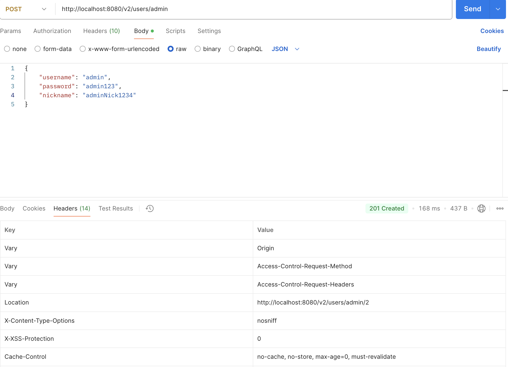

#### 📤 성공 응답
- `201 Created`: 어드민 회원가입 성공
  → `Location` 헤더에 생성된 어드민 URI 포함

#### ❌ 예외 응답
- `400 Bad Request`: 회원 필드 유효성 검증 실패 
- `409 Conflict`:  중복된 필드 존재 (username/password/email/nickname)
- `500 Internal Server Error`: 서버 오류

### 🔐 일반 로그인

| Method | Endpoint        | 인증     | 권한 조건     |
|--------|-----------------|--------|-----------|
| POST   | /v2/users/login | 🔓 불필요 | 누구나 호출 가능 |


#### 📥 Request Body 형식
```json
{
  "username": "string", 
  "password": "string"
}
```

#### 📸 Postman 예시 화면
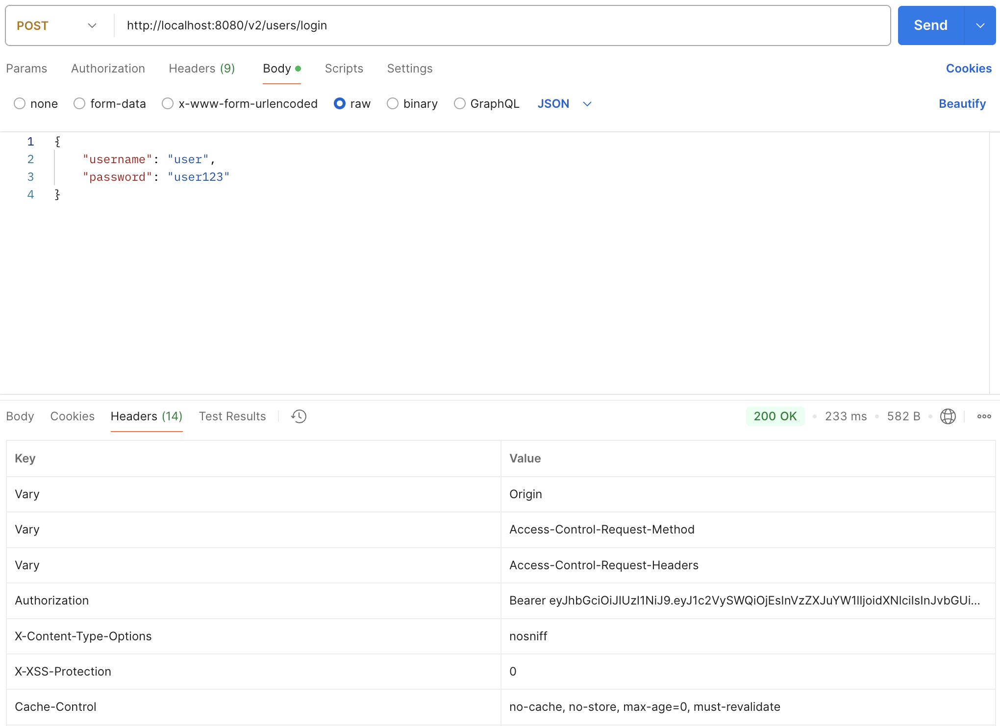

#### 📤 성공 응답
- `200 OK`: 로그인 성공
  → 응답 헤더에 JWT 포함

#### ❌ 예외 응답
- `400 Bad Request`: 회원 필드 유효성 검증 실패
- `401 Unauthorized`: 아이디 혹은 비밀번호 불일치
- `500 Internal Server Error`: 서버 오류

### 📬 소셜 로그인(Google)

| Method | Endpoint                     | 인증     | 권한 조건     |
|--------|------------------------------|--------|-----------|
| GET    | /oauth2/authorization/google | 🔓 불필요 | 누구나 호출 가능 |


#### 📸 Postman 예시 화면
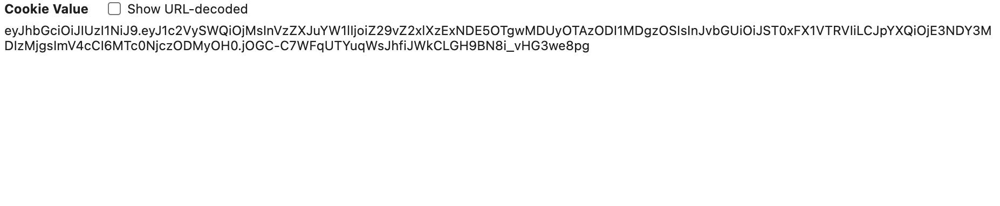

#### 📤 성공 응답
- `302 Redirect`: Google 로그인 창으로 리다이렉트
- 로그인 성공 시, 토큰과 함께 3000번 포트로 리디이렉트

#### ❌ 예외 응답
- `401 Unauthorized`: 소셜 로그인 실패 또는 미승인 사용자
- `500 Internal Server Error`: 서버 오류

### 📄 회원 게시글 목록 조회 1

| Method | Endpoint                  | 인증    | 권한 조건    |
|--------|---------------------------|-------|----------|
| GET    | /v2/users/me/posts-simple | 🔒 필요 | 로그인한 사용자 |


#### 📸 Postman 예시 화면
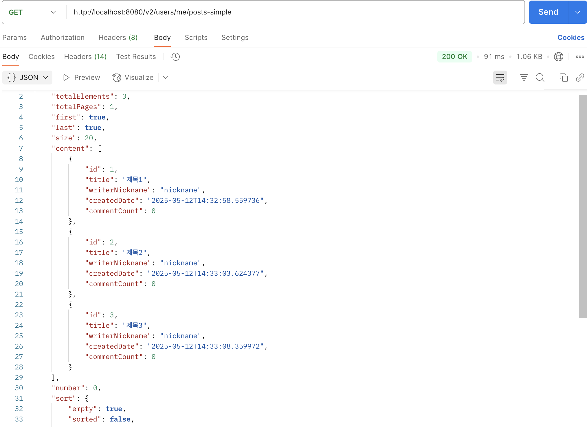

#### 📤 성공 응답
- `200 OK`: 게시글 목록 조회 성공

#### ❌ 예외 응답
- `404 Not Found`: 존재하지 않거나 삭제된 사용자 ID
- `500 Internal Server Error`: 서버 오류

### 📄 회원 게시글 목록 조회 2

| Method | Endpoint                    | 인증    | 권한 조건    |
|--------|-----------------------------|-------|----------|
| GET    | /v2/users/me/posts-standard | 🔒 필요 | 로그인한 사용자 |


#### 📸 Postman 예시 화면
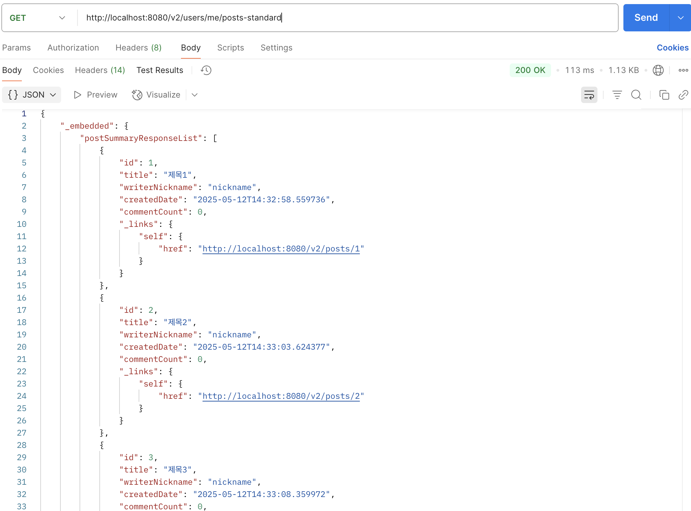

#### 📤 성공 응답
- `200 OK`: 게시글 목록 조회 성공
  → links - self에 생성된 게시글 URI 포함

#### ❌ 예외 응답
- `404 Not Found`: 존재하지 않거나 삭제된 사용자 ID
- `500 Internal Server Error`: 서버 오류

### 🛠️ 회원 정보 수정

| Method | Endpoint     | 인증    | 권한 조건    |
|--------|--------------|-------|----------|
| PATCH  | /v2/users/me | 🔒 필요 | 로그인한 사용자 |


#### 📥 Request Body 형식
```json
{
  "username": "string", // 변경할려면 3~20자 사이여야 함
  "email": "string", 
  "nickname": "string" 
}
```

#### 📸 Postman 예시 화면


#### 📤 성공 응답
- `204 No Content`: 회원 정보 수정 성공

#### ❌ 예외 응답
- `400 Bad Request`: 회원 필드 유효성 검증 실패
- `404 Not Found`: 존재하지 않거나 삭제된 사용자 ID
- `409 Conflict`: 중복된 필드 존재
- `500 Internal Server Error`: 서버 오류

### 🔑 비밀번호 변경

| Method | Endpoint              | 인증    | 권한 조건    |
|--------|-----------------------|-------|----------|
| PATCH  | /v2/users/me/password | 🔒 필요 | 로그인한 사용자 |


#### 📥 Request Body 형식
```json
{
  "currentPassword": "string", // 기존 비밀번호는 필수
  "newPassword": "string" // 바꿀 비밀번호도 필수
}
```

#### 📸 Postman 예시 화면
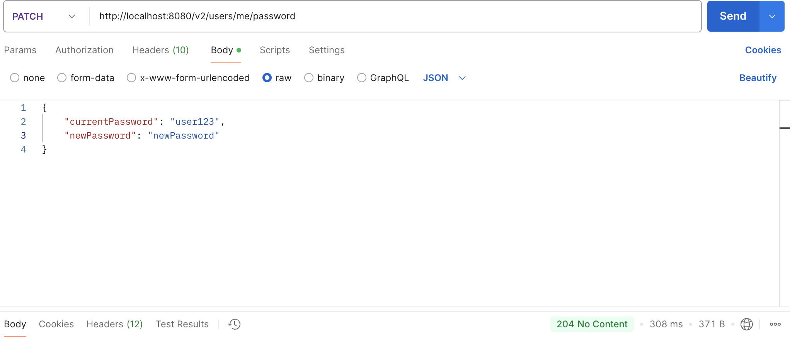
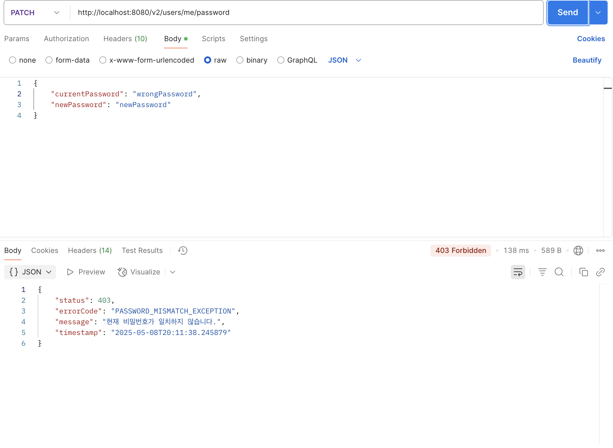

#### 📤 성공 응답
- `204 No Content`: 비밀번호 수정 성공

#### ❌ 예외 응답
- `400 Bad Request`: 회원 필드 유효성 검증 실패
- `403 Forbidden`: 현재 비밀번호 증일치
- `404 Not Found`: 존재하지 않거나 삭제된 사용자 ID
- `500 Internal Server Error`: 서버 오류

### 🚪 회원 탈퇴

| Method | Endpoint     | 인증    | 권한 조건    |
|--------|--------------|-------|----------|
| DELETE | /v2/users/me | 🔒 필요 | 로그인한 사용자 |


#### 📸 Postman 예시 화면
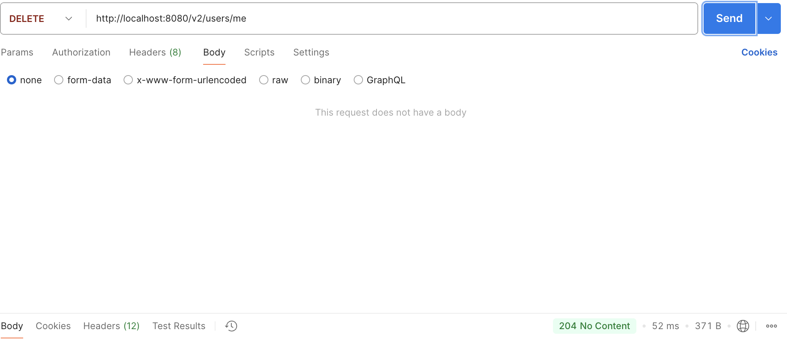

#### 📤 성공 응답
- `204 No Content`: 회원 탈퇴 성공

#### ❌ 예외 응답
- `404 Not Found`: 존재하지 않거나 삭제된 사용자 ID
- `500 Internal Server Error`: 서버 오류

### 📝 게시글 작성

| Method | Endpoint           | 인증    | 권한 조건    |
|--------|--------------------|-------|----------|
| POST   | /v2/users/me/posts | 🔒 필요 | 로그인한 사용자 |


#### 📥 Request Body 형식
```json
{
  "title": "string", // 제목은 필수
  "content": "string"
}
```

#### 📸 Postman 예시 화면


#### 📤 성공 응답
- `201 Created`: 게시글 작성 성공
  → `Location` 헤더에 생성된 게시글 URI 포함

#### ❌ 예외 응답
- `400 Bad Request`: 게시글 필드 유효성 검증 실패
- `404 Not Found`: 존재하지 않거나 삭제된 사용자 ID
- `500 Internal Server Error`: 서버 오류

### 📚 전체 게시글 조회

| Method | Endpoint  | 인증     | 권한 조건     |
|--------|-----------|--------|-----------|
| GET    | /v2/posts | 🔓 불필요 | 누구나 호출 가능 |


#### 📸 Postman 예시 화면
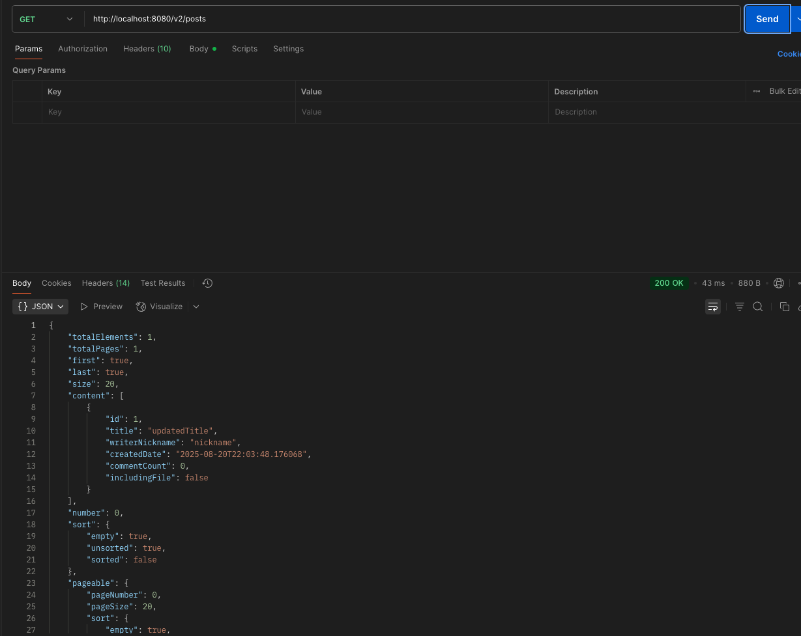

#### 📤 성공 응답
- `200 OK`: 전체 게시글 페이징 목록 반환

#### ❌ 예외 응답
- `500 Internal Server Error`: 서버 오류

### 🔍 게시글 상세 조회

| Method | Endpoint           | 인증     | 권한 조건     |
|--------|--------------------|--------|-----------|
| GET    | /v2/posts/{postId} | 🔓 불필요 | 누구나 호출 가능 |


#### 📸 Postman 예시 화면
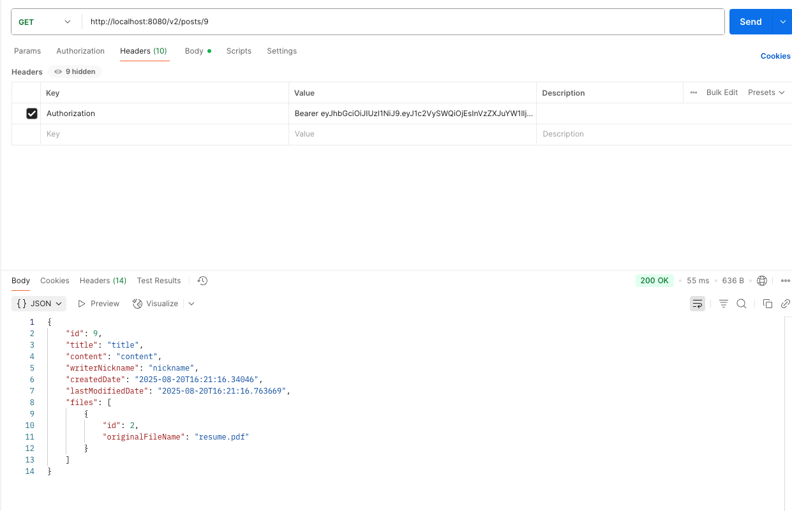

#### 📤 성공 응답
- `200 OK`: 게시글 상세 정보 반환

#### ❌ 예외 응답
- `404 Not Found`: 게시글 없음 또는 삭제됨
- `500 Internal Server Error`: 서버 오류

### 🔎 게시글 검색 

| Method | Endpoint         | 인증     | 권한 조건     |
|--------|------------------|--------|-----------|
| GET    | /v2/posts/search | 🔓 불필요 | 누구나 호출 가능 |

#### 📥 Request Body 형식
```json
{
  "writer": "string", // 작성자 nickname 조건
  "title": "string" // 제목 조건
}
```

#### 📸 Postman 예시 화면
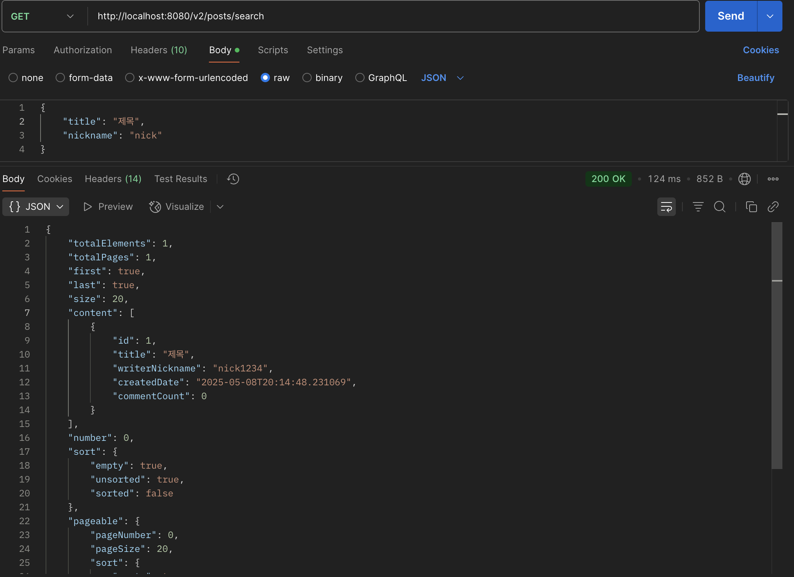

#### 📤 성공 응답
- `200 OK`: 검색 조건에 맞는 게시글 목록 반환

#### ❌ 예외 응답
- `500 Internal Server Error`: 서버 오류

### ✏️ 게시글 수정

| Method | Endpoint           | 인증    | 권한 조건   |
|--------|--------------------|-------|---------|
| PATCH  | /v2/posts/{postId} | 🔒 필요 | 작성자만 가능 |


#### 📥 Request Body 형식
```json
{
  "title": "string",
  "content": "string"
}
```

#### 📸 Postman 예시 화면
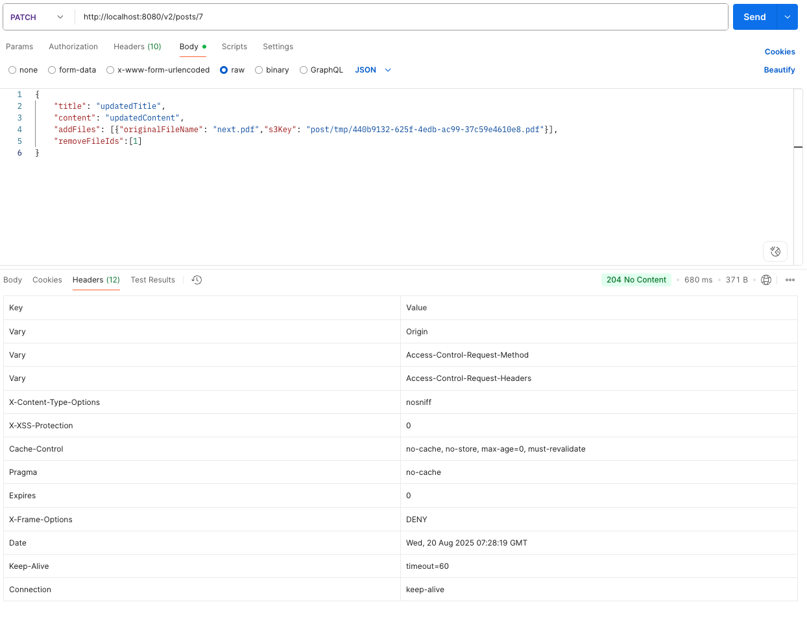

#### 📤 성공 응답
- `204 No Content`: 게시글 수정 성공

#### ❌ 예외 응답
- `400 Bad Request`: 게시글 필드 유효성 검증 실패
- `404 Not Found`: 게시글 없음 또는 삭제됨
- `500 Internal Server Error`: 서버 오류

### 🗑️ 게시글 삭제

| Method | Endpoint           | 인증    | 권한 조건   |
|--------|--------------------|-------|---------|
| DELETE | /v2/posts/{postId} | 🔒 필요 | 작성자만 가능 |


#### 📸 Postman 예시 화면


#### 📤 성공 응답
- `204 No Content`: 게시글 삭제 성공

#### ❌ 예외 응답
- `404 Not Found`: 게시글 없음 또는 삭제됨
- `500 Internal Server Error`: 서버 오류

### 💬 댓글 작성

| Method | Endpoint                    | 인증    | 권한 조건    |
|--------|-----------------------------|-------|----------|
| POST   | /v2/posts/{postId}/comments | 🔒 필요 | 로그인한 사용자 |


#### 📥 Request Body 형식
```json
{
  "content": "string" // null 금지 but 빈 문자열 가능
}
```

#### 📸 Postman 예시 화면
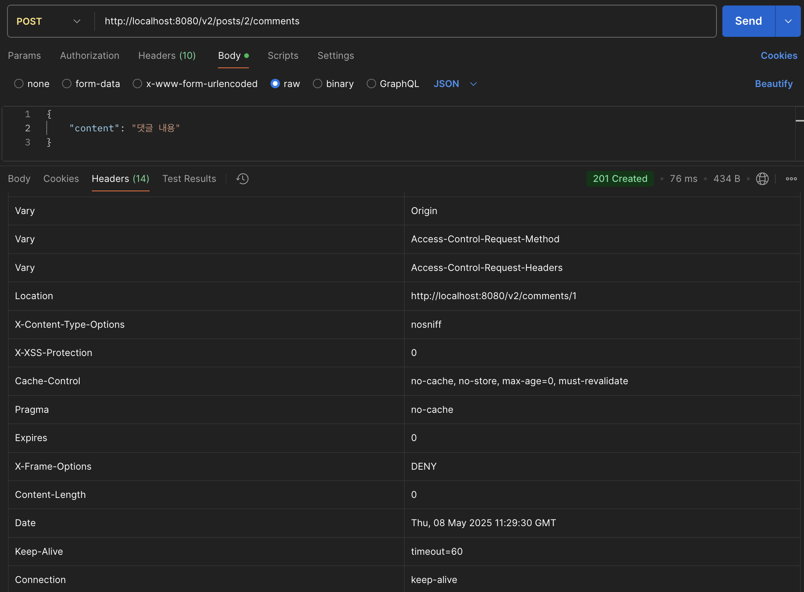

#### 📤 성공 응답
- `201 Created`: 댓글 작성 성공
  → `Location` 헤더에 생성된 댓글 URI 포함

#### ❌ 예외 응답
- `400 Bad Request`: 댓글 필드 유효성 검증 실패
- `404 Not Found`: 게시글 없음 또는 삭제됨
- `500 Internal Server Error`: 서버 오류

### 📄 댓글 조회

| Method | Endpoint                    | 인증     | 권한 조건     |
|--------|-----------------------------|--------|-----------|
| GET    | /v2/posts/{postId}/comments | 🔓 불필요 | 누구나 호출 가능 |


#### 📸 Postman 예시 화면
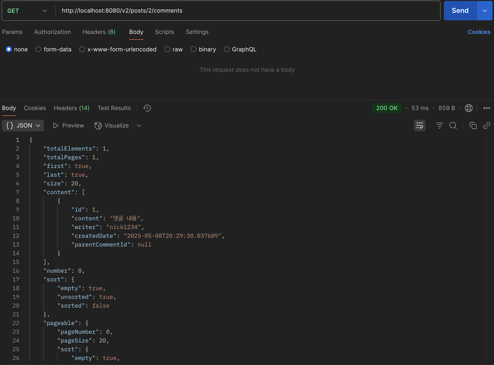

#### 📤 성공 응답
- `200 OK`: 댓글 목록 조회 성공 (flat 구조 + parentCommentId)

#### ❌ 예외 응답
- `404 Not Found`: 게시글 없음 또는 삭제됨

### ↪️ 대댓글 작성

| Method | Endpoint                               | 인증    | 권한 조건    |
|--------|----------------------------------------|-------|----------|
| POST   | /v2/comments/{parentCommentId}/replies | 🔒 필요 | 로그인한 사용자 |


#### 📥 Request Body 형식
```json
{
  "postId": "string", 
  "content": "string" // null 금지 but 빈 문자열 가능
}
```

#### 📸 Postman 예시 화면
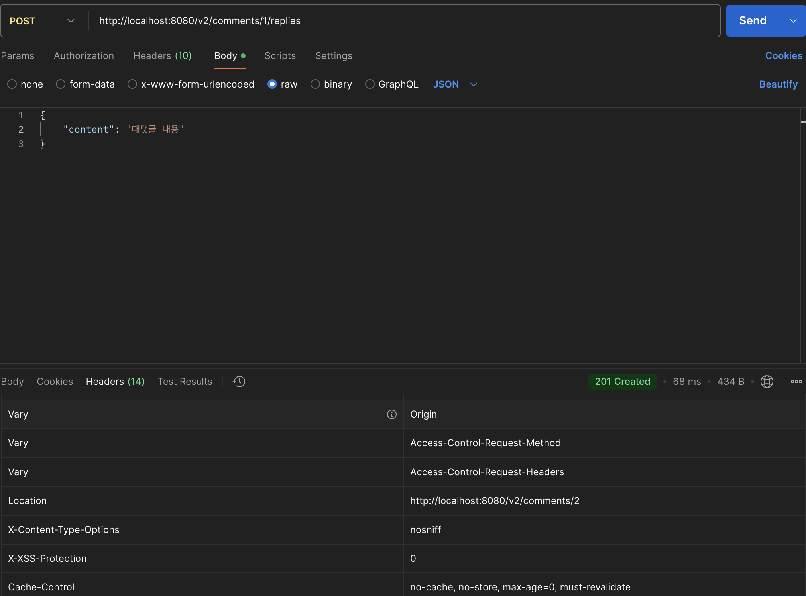

#### 📤 성공 응답
- `201 Created`: 대댓글 작성 성공
  → `Location` 헤더에 생성된 대댓글 URI 포함

#### ❌ 예외 응답
- `400 Bad Request`: 댓글 필드 유효성 검증 실패
- `404 Not Found`: 부모 댓글 또는 게시글 없음
- `500 Internal Server Error`: 서버 오류

### 📑 댓글 상세 조회

| Method | Endpoint                 | 인증     | 권한 조건     |
|--------|--------------------------|--------|-----------|
| GET    | /v2/comments/{commentId} | 🔓 불필요 | 누구나 호출 가능 |


#### 📸 Postman 예시 화면
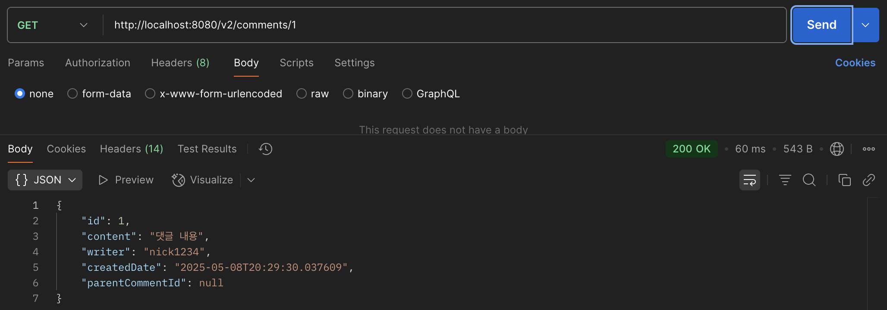

#### 📤 성공 응답
- `200 OK`: 댓글 상세 정보 반환

#### ❌ 예외 응답
- `404 Not Found`: 댓글 없음 또는 삭제됨
- `500 Internal Server Error`: 서버 오류

### 📝 댓글 수정

| Method | Endpoint                 | 인증    | 권한 조건   |
|--------|--------------------------|-------|---------|
| PATCH  | /v2/comments/{commentId} | 🔒 필요 | 작성자만 가능 |


#### 📥 Request Body 형식
```json
{
  "content": "string"
}
```

#### 📸 Postman 예시 화면
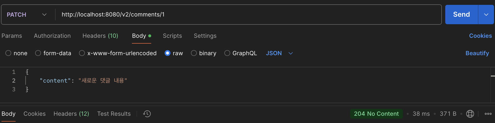

#### 📤 성공 응답
- `204 No Content`: 댓글 수정 성공

#### ❌ 예외 응답
- `400 Bad Request`: 댓글 필드 유효성 검증 실패
- `404 Not Found`: 댓글 없음 또는 삭제됨
- `500 Internal Server Error`: 서버 오류

### 🗑️ 댓글 삭제

| Method | Endpoint                 | 인증    | 권한 조건   |
|--------|--------------------------|-------|---------|
| DELETE | /v2/comments/{commentId} | 🔒 필요 | 작성자만 가능 |


#### 📸 Postman 예시 화면
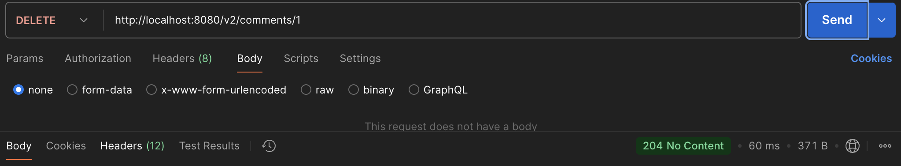

#### 📤 성공 응답
- `204 No Content`: 댓글 삭제 성공

#### ❌ 예외 응답
- `404 Not Found`: 댓글 없음 또는 삭제됨
- `500 Internal Server Error`: 서버 오류

## 🔗프로젝트 관련 블로그 링크

---
- 프로젝트 상세 설명: 프로젝트 상세 설명 블로그 링크를 추후에 추가
- 트러블 슈팅: 트러블 슈팅 블로그 링크를 추후에 추가


## 👨‍💻 개발자 정보

---
- **이름(name)**: 홍우현 (Hong, Woo-Hyeon)
- **이메일(email)**: woohyeon6885@gmail.com
- **GitHub**: [https://github.com/Woohyeon-Hong](https://github.com/Woohyeon-Hong)


